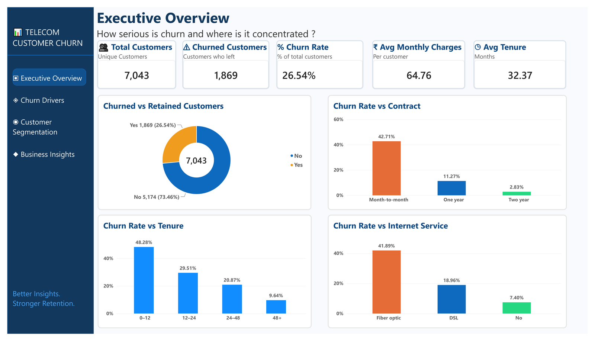
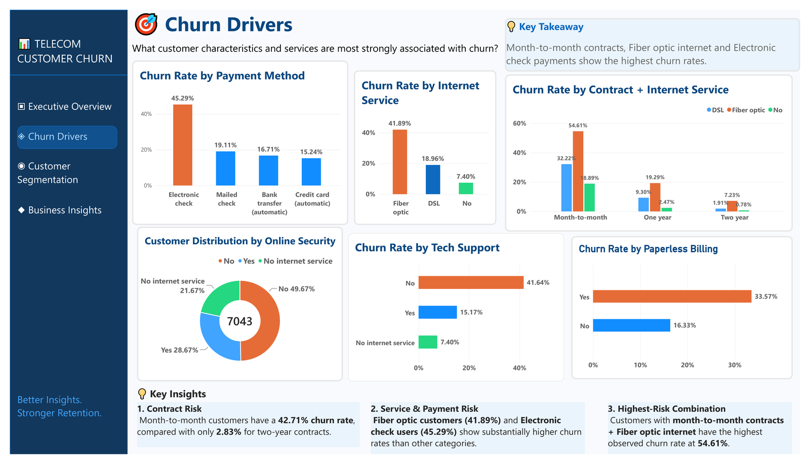
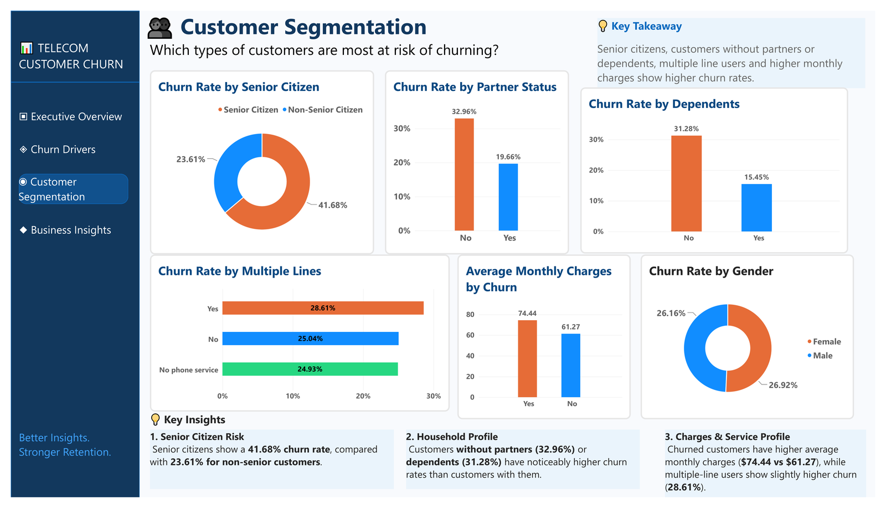
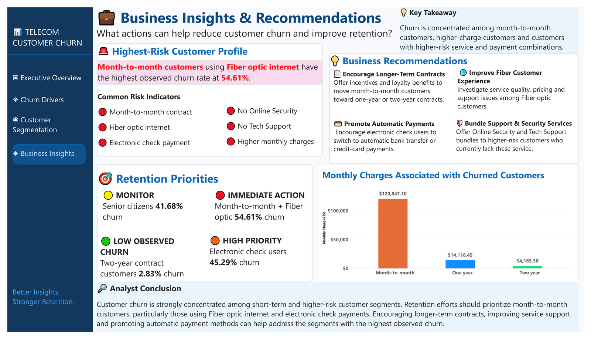
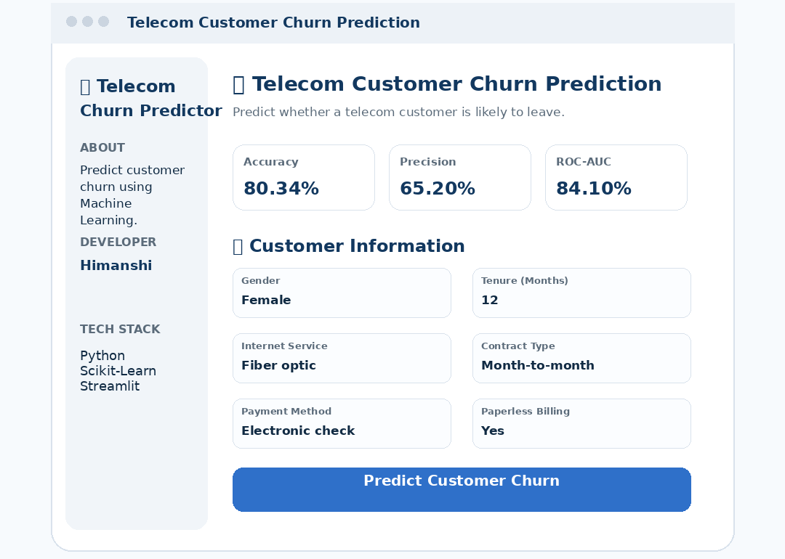

# 📡 Telecom Customer Churn Prediction

A Machine Learning web application that predicts whether a telecom customer is likely to churn, based on customer demographics, account information, and subscribed services — backed by a full SQL/Power BI diagnostic analysis of *why* customers churn.


---

## 🔗 Live Demo

**Live Application:** https://telecom-customer-churn-prediction-app07.streamlit.app/
**GitHub Repository:** https://github.com/Himanshi7104/telecom-customer-churn-prediction

---

## 📖 Project Overview

Customer churn is one of the biggest challenges telecom companies face — acquiring a new customer costs far more than retaining an existing one. This project tackles the problem end to end:

1. **Exploratory & diagnostic analysis** (Python + SQL-style cross-tabulation) to find *where* churn is concentrated
2. **A 4-page Power BI dashboard** to communicate those findings to a business audience
3. **Five machine learning models** trained and compared to predict churn
4. **A deployed Streamlit app** that turns the winning model into a live, interactive tool

Given a customer's profile, the app instantly returns:
- Churn Prediction (Yes/No)
- Churn Probability
- Risk Level (Low / Medium / High)
- Key Factors driving the prediction
- Suggested Business Action
- Estimated Monthly Charges
- Estimated Total Charges

---

## 🔑 Key Insights from the Data

Analysis of 7,043 customers (26.54% overall churn rate) surfaced a clear pattern: churn wasn't random, it was concentrated in a few identifiable segments.

| Factor | Churn Rate | Notes |
|---|---|---|
| Month-to-month contract | **42.71%** | vs. 11.27% (one-year) and 2.83% (two-year) — a ~15x gap |
| Fiber optic internet | **41.89%** | vs. 18.96% (DSL), 7.40% (no internet) |
| Electronic check payment | **45.29%** | vs. 15–19% for automatic payment methods |
| Month-to-month **+** Fiber optic (combined) | **54.61%** | highest-risk segment observed |
| Senior citizens | **41.68%** | vs. 23.61% for non-seniors |
| Customers without a partner | 32.96% | vs. 19.66% with a partner |
| Customers without dependents | 31.28% | vs. 15.45% with dependents |

Feature-importance analysis (Logistic Regression coefficients) confirmed **contract type, tenure, and internet service** as the three strongest predictors of churn — customers with longer tenure and longer contracts were consistently less likely to leave.

Full breakdown: [`Telco_Customer_Churn.ipynb`](./Telco_Customer_Churn.ipynb)

---

## 🗄️ SQL Analysis

The same churn-driver questions explored with pandas were re-run directly in **SQL**, by loading the cleaned dataset into a SQLite database (`churn.db`) and querying it — a good practice for working with relational data and for validating findings against a second method.

**Example query — churn rate by contract type:**

```sql
SELECT Contract,
       COUNT(*) AS total_customers,
       SUM(CASE WHEN Churn = 'Yes' THEN 1 ELSE 0 END) AS churned,
       ROUND(100.0 * SUM(CASE WHEN Churn = 'Yes' THEN 1 ELSE 0 END) / COUNT(*), 2) AS churn_rate_pct
FROM customers
GROUP BY Contract
ORDER BY churn_rate_pct DESC;
```

**Highest-risk combination — grouping on two dimensions at once:**

```sql
SELECT Contract, InternetService,
       COUNT(*) AS total,
       ROUND(100.0 * SUM(CASE WHEN Churn = 'Yes' THEN 1 ELSE 0 END) / COUNT(*), 2) AS churn_rate_pct
FROM customers
GROUP BY Contract, InternetService
HAVING total > 20
ORDER BY churn_rate_pct DESC
LIMIT 5;
```

Additional queries cover average monthly charges by churn status, churn rate by tenure bucket (using a SQL `CASE` statement), internet service type, and payment method — all in Section 21 of the notebook.

**Result:** every SQL query confirmed the pandas-based EDA in Section 5, while the two-dimension grouping surfaced something the single-factor breakdowns couldn't show on their own — that Month-to-month contracts and Fiber optic service **compound** each other rather than acting independently, producing the 54.61% highest-risk segment.

---

## 📊 Power BI Dashboard

**Executive Overview** — churn rate, tenure, contract type, and internet service at a glance.



**Churn Drivers** — diagnostic breakdown of payment method, internet service, and the highest-risk customer combinations.



**Customer Segmentation** — which customer profiles are most at risk.



**Business Insights & Recommendations** — retention priorities ranked by observed risk.



---

## 🤖 Machine Learning Model

### Model Comparison

Five classification models were trained and evaluated on the same 80/20 train-test split:

| Model | Accuracy | Precision | Recall | ROC-AUC |
|---|---|---|---|---|
| **Logistic Regression** ✅ | 80.70% | 65.84% | 56.68% | 84.16% |
| Gradient Boosting | 79.91% | 65.42% | 51.60% | **84.26%** |
| Random Forest | 78.64% | — | 49.20% | 82.51% |
| K-Nearest Neighbors | 74.73% | — | 50.00% | 77.16% |
| Decision Tree | 74.17% | 51.39% | 49.47% | 66.23% |

**Logistic Regression was selected as the final model** for its balanced performance across accuracy, precision, recall, and F1-score — even though Gradient Boosting edged it out on ROC-AUC alone. Hyperparameter tuning via `GridSearchCV` (5-fold CV, optimizing ROC-AUC) confirmed the baseline was already close to optimal (best params: `C=10`, `solver=liblinear`).

The deployed model reports **80.34% accuracy, 65.20% precision, and 84.10% ROC-AUC** in the live app.

Data preprocessing included missing-value handling, categorical encoding, and feature scaling. The trained model and scaler were saved with **Joblib** and integrated into the Streamlit app.

### Monthly Charges Estimation

The app also estimates a customer's `MonthlyCharges` automatically, instead of requiring manual entry, using a separate **Gradient Boosting Regressor** trained on demographics, tenure, and subscribed services (`MonthlyCharges`, `TotalCharges`, and `Churn` were excluded from its inputs to avoid data leakage).

```
Estimated Total Charges = Estimated Monthly Charges × Tenure
```

**MAE:** 0.85 · **R²:** 0.9986

---

## 🚀 Live App



👉 **Try it here:** https://telecom-customer-churn-prediction-app07.streamlit.app/

### Features
- Interactive Streamlit web application
- Real-time churn prediction with probability score
- Risk level classification (Low / Medium / High)
- Automatic Monthly & Total Charges estimation
- Key risk indicators and business recommendations
- Clean, user-friendly interface

---

## 💡 Business Recommendations

1. **Encourage long-term contracts** — offer discounts/loyalty rewards for switching to 1- or 2-year plans
2. **Improve the Fiber Optic experience** — survey satisfaction, investigate service quality and pricing
3. **Focus on new customers** — onboarding programs and personalized offers in the first 6 months
4. **Monitor high-risk payment methods** — incentivize a switch from electronic check to AutoPay/credit card
5. **Build targeted retention campaigns** using the model's risk scores to prioritize outreach

---

## 🛠️ Tech Stack

`Python` · `Pandas` · `NumPy` · `Scikit-learn` · `Streamlit` · `Joblib` · `Matplotlib` · `Seaborn` · `SQL (SQLite)` · `Power BI`

---

## 📁 Project Structure

```
telecom-customer-churn-prediction/
│
├── app.py                        # Streamlit application
├── Telco_Customer_Churn.ipynb    # Full EDA + model training notebook
├── logistic_regression_model.pkl # Trained churn prediction model
├── monthly_charges_model.pkl     # Trained charges estimation model
├── scaler.pkl                    # StandardScaler used for churn model
├── requirements.txt
├── screenshots/                  # Dashboard & app screenshots (used in this README)
├── dashboard/                    # Power BI (.pbix) file
└── README.md
```

---

## ⚙️ Installation

```bash
# Clone the repository
git clone https://github.com/Himanshi7104/telecom-customer-churn-prediction.git
cd telecom-customer-churn-prediction

# Install dependencies
pip install -r requirements.txt

# Run the application
streamlit run app.py
```

---

## 📈 Dataset

**IBM Telco Customer Churn Dataset** — 7,043 customers, with features covering demographics, account tenure, contract details, subscribed services, billing information, and payment method.

---

## 🔮 Future Improvements

- [ ] SHAP-based model explainability
- [ ] Batch (CSV upload) prediction support
- [ ] Docker deployment
- [ ] Model monitoring in production
- [ ] Improved UI/UX

---

## 👩‍💻 Author

**Himanshi**
🔗 [LinkedIn](http://www.linkedin.com/in/himanshi0710/) · [GitHub](https://github.com/Himanshi7104) · [Live App](https://telecom-customer-churn-prediction-app07.streamlit.app/)

---

⭐ If this project was useful or interesting, consider starring the repo!
